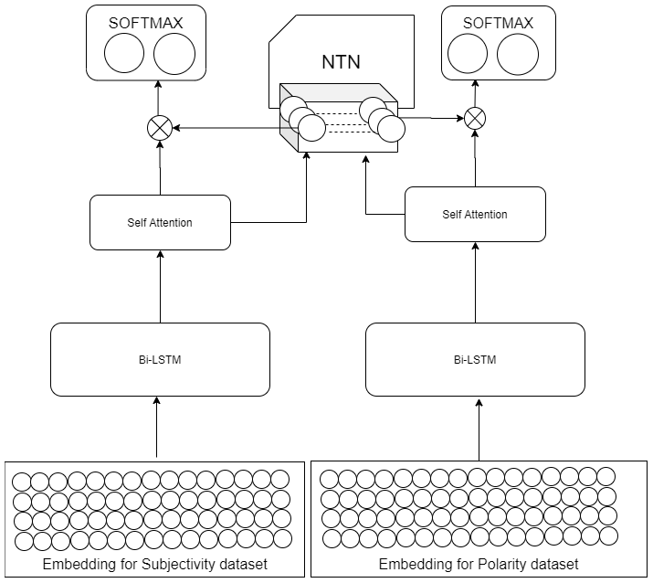

Polarity and Subjective classification with Multitask Learning and BERT Embedding
================
>Multi task learning often helps to improve the perfor-mance of related tasks. Related tasks often have inter-dependence  on  each  other  and  perform  better  whensolved in a joint framework. In this paper, we presenta deep multi-task learning framework that jointly performs sentiment and subjective analysis. We propose an attention based multi task model for predicting the sentiment and subjectivity. The input sentences are transformed using pretrained BERT and Glove embeddings and  the  results  depict  that  BERT  embedding  based model works better than Glove based model. We com-pare our approach with state of the art models in bothsubjective  and  sentiment  classification  in  both  singletask  and  multi  task  frameworks.  Our  results  suggest that multitask learning framework offers improvement over the single task framework even with two different datasets.

## Folder Structure:

    ├── Codes                       # Contains Python Notebooks (*.ipynb)
    |   ├── Data Preprocessing         
    │   ├── Bert Embeddings         
    |   ├── Bert Model 
    |   ├── Glove Model 
    ├── Dataset                   
    │   ├── Polarity_data
    |   |   ├── Bert Embeddings      # bert embeddings 
    |   |   ├── sentiment.csv        # csv file 
    |   |   ├── sentiment.pkl        # Glove embeddings 
    │   ├── Subjective_data 
    |   |   ├── Bert Embeddings      # bert embeddings 
    |   |   ├── subjective.csv       # csv file 
    |   |   ├── subjective.pkl       # Glove embeddings      
    └──  Results                     

## Dataset

1. [Polarity Dataset](https://perun.pmf.uns.ac.rs/radovanovic/dmsem/cd/datasets/text/MovieReviews/rt-polaritydata.tar.gz): The dataset contains 5331 positive and 5331 negative processed sentences.We take 5000 from each class randomly.
2. [Subjectivity Dataset](http://www.cs.cornell.edu/people/pabo/movie-review-data/rotten_imdb.tar.gz): The dataset contains 5000 subjective and 5000 objective processed sentences.

| Dataset | Train | Dev | Test | Max Length | Avg. Length | Vocab |
| :------ |:--- | :--- | :--- | :--- | :--- | :--- | 
| POL | 7.2K | 800| 2K | 40 | 15 |16.5k |
| SUBJ | 7.2K | 800 | 2K | 85 |17 |18.5k|

## Model Architecture



## Results

| | Framework | Subjective | Polarity |
| :------ |:--- | :--- | :--- |
| Baselines | SenticNet 5 <br> Subjective detector <br> Multi-task uniform layer <br> Multi-task shared-layer| - <br> 92% <br> 93.4% <br> **94.1%** | **92.8%** <br> - <br> 87.1% <br> 87.9%|
| BERT Embedding | *BILSTM*<sub>pol</sub> <br> *BILSTM*<sub>subj</sub> <br> *MTL*<sub>sharedNTN</sub> | - <br> 93.5% <br> **95.1%** | 77.5% <br> - <br> **94.6%** |
| GLOVE Embedding |  *BILSTM*<sub>subj</sub> <br> *BILSTM*<sub>pol</sub> <br> *MTL*<sub>sharedNTN</sub> | 90.7% <br> - <br> **92.3%** | - <br> 75.9% <br> **92.1%** |


## Prerequisites
```
!pip install numpy
!pip install sklearn
!pip install pandas
!pip install csv
!pip install scipy
!pip install keras
!pip install keras-self-attention

```
## How to run the code

1. Install the prequisites mentioned above.
2. Run '/codes/Bert_model.ipynb'
3. Run '/codes/Glove_model.ipynb'

Note: The glove and bert embeddings of both the datasets are provided. Make sure you check the relative paths before running the code and change the file names while saving the model.

## Citation
```
@unpublished{ranjan,
author = "Ranjan Satapathy, Shweta Pardeshi, Erik Cambria",
title = "Polarity and Subjective classification with Multitask Learning and BERT Embedding"
journal = arXiv preprint arXiv:2201.05363
doi = "https://doi.org/10.48550/arXiv.2201.05363"
}
```